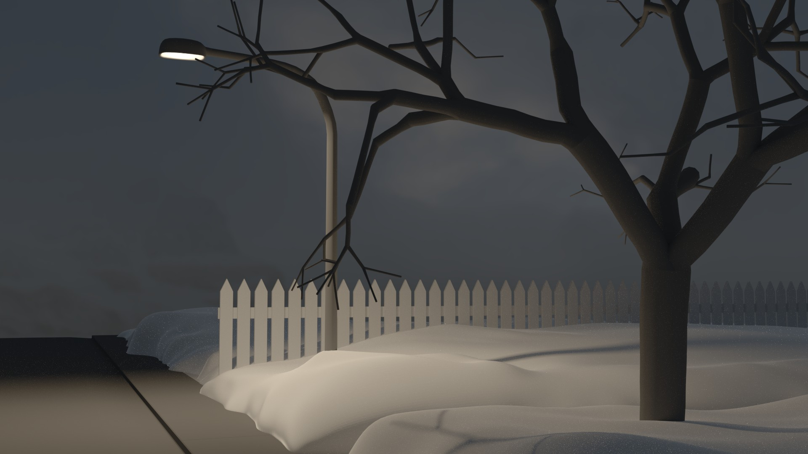

Here are a few 3d renders I've made, largely going back quite a long time. I first became interested in 3d graphics in high school first using Blender and later Autodesk Maya. This interest eventually led to my studying areas of programming more generally which somewhat overtook it. It's something I still have a great deal of interest in, however and I would love to do more in future. A lot of these projects I've largely forgotten about over the years often unfinished. Sometimes I find them in obscure corners of old hard drives and end up rather impressed by the WIP renders. 

