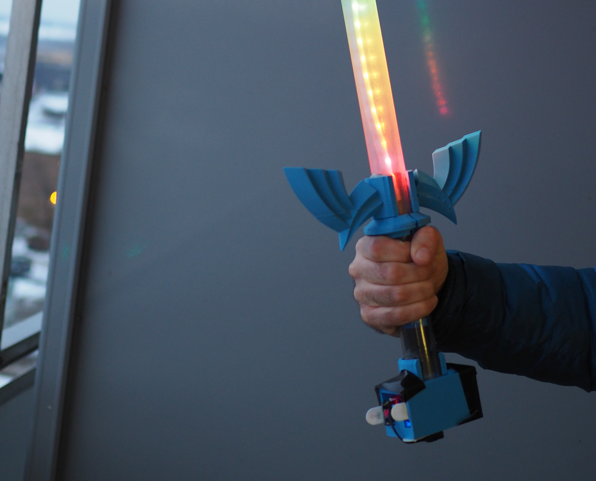
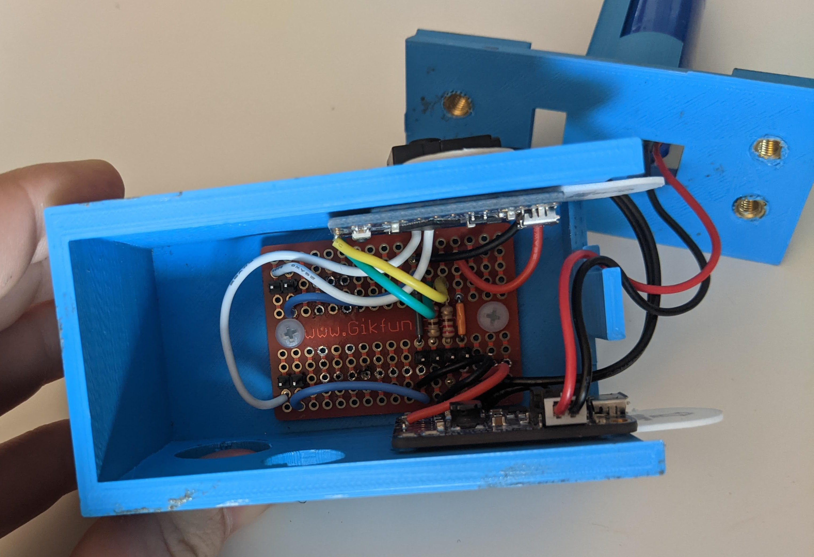
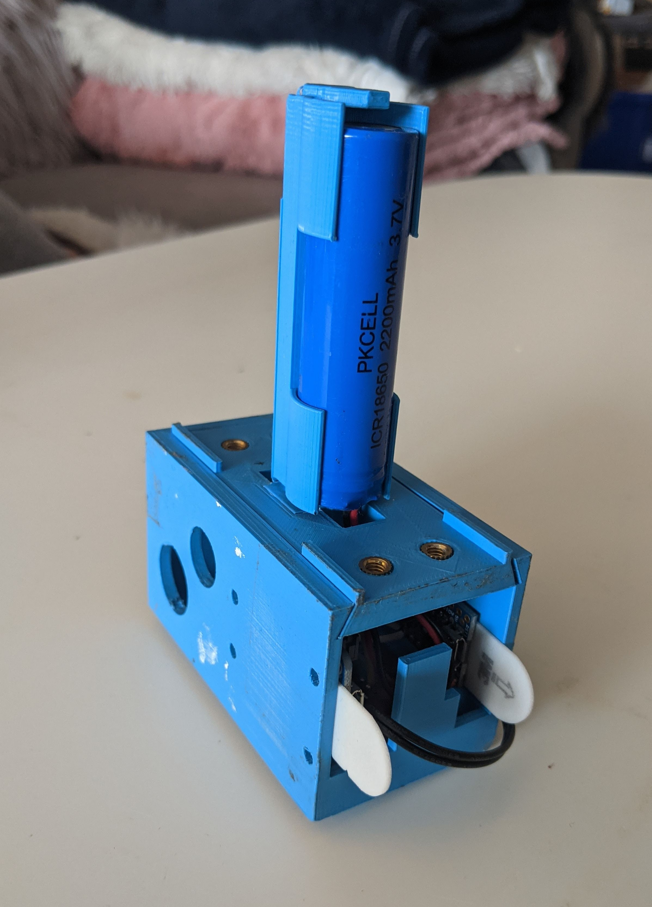

This is a sword I made to take to two large music festivals in the summer of 2019. The cross guard and housing for the electronics were 3d printed and the blade uses an animated LED strip controlled with a small arduino in a polycarbonate tube to diffuse the light. The sword is powered with a lithium ion battery and recharged via USB. I initially intended to use a much higher density LED strip, but I accidentally damaged it and had to substitute a less dense one I had on hand. The result was still impressive, but I'm planning on replacing it with the full density strip soon. 

You can find a list of parts and the blender files on Github. 

It was a great challenge to build something more physical and I'm quite proud of the result.

The design of the cross guard is based on the Master Sword from the Legend of Zelda games, as I have fond memories of them from childhood and I wanted a design that would be recognisable. All the components were modelled in blender, and 3d printed at the SparQ maker space at Queen's University. The Arduino controlling the sword was programmed in C++ using the FastLED library. 

By far the most difficult part of the project was designing the housing for the electronics. The requirement that made the project difficult was that the entire thing had to be completely indestructible. 

It had to be in as small a form factor as possible, and I needed to be able to open and close it to access and install the electronic components. The duct tape you can see in the picture is not a repair job, it was actually part of the design, I intended quite early on to use it to reinforce the joints. I didn't trust any mechanism I could easily 3d print to securely hold the casing in it's closed position by itself and survive the rigours of camping.

The project survived two multi-day camping music festivals entirely unscathed. 

