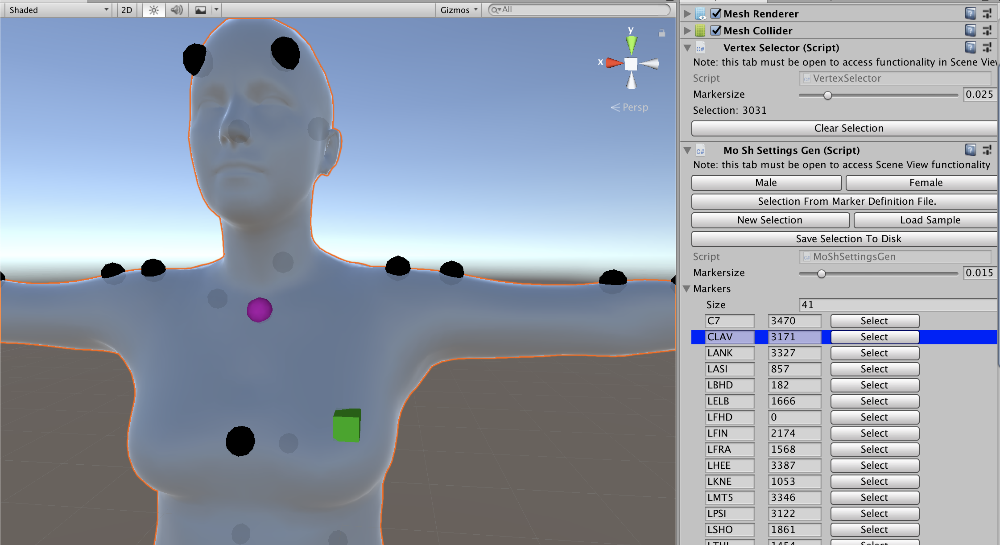
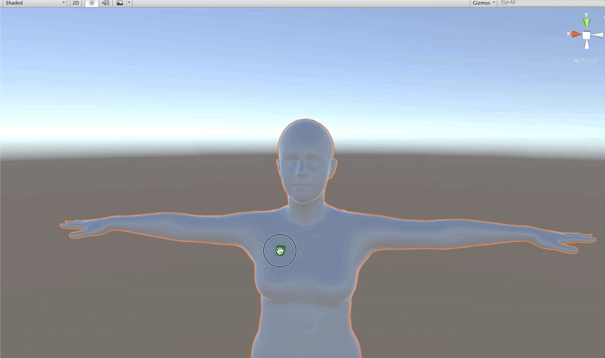
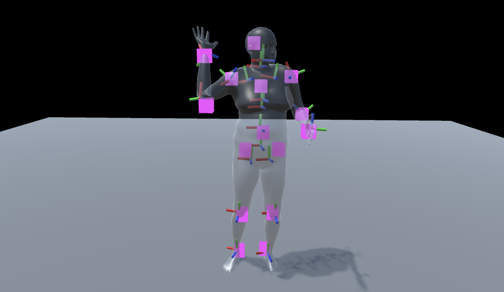

The BioMotion Lab is a psychology lab formerly based at Queen's, now at York, that researches how we perceive human motion, developing experiments using motion capture and VR. I did my undergraduate final project with the lab as well as working on a number of projects as a volunteer and employee.

[I'm an inline-style link](https://www.google.com)

[I'm an inline-style link with title](https://www.google.com "Google's Homepage")

[I'm a reference-style link][Arbitrary case-insensitive reference text]

[I'm a relative reference to a repository file](../blob/master/LICENSE)

[You can use numbers for reference-style link definitions][1]

Or leave it empty and use the [link text itself].

URLs and URLs in angle brackets will automatically get turned into links. 
http://www.example.com or <http://www.example.com> and sometimes 
example.com (but not on Github, for example).

Some text to show that the reference links can follow later.

[arbitrary case-insensitive reference text]: https://www.mozilla.org
[1]: http://slashdot.org
[link text itself]: http://www.reddit.com

The BioMotion Lab was in the process of adopting a new motion capture algorithm called MoSh (Motion and Shape) developed at the Max Planck Institute in Tübingen that approximates the body shape of the subject using a parametric model of the human body and is compatible with standard marker based motion capture systems. The algorithm could be used with prior mocap data, and did not require a specific set of marker placements, which was useful for the lab as they had built up a large library of captures. I worked on and built a number of systems in Unity as part of this. 

# Mocap Pipeline Tool - Vertex Selector

The first tool I developed was a graphical utility to simplify the pipeline of applying the new algorithm to raw motion capture data. The algorithm required an input file associating the approximate location of motion capture markers with a vertex index on the mesh. I built a program with a GUI for selecting and labelling vertices and generating the file.

The functionality for vertex selection in the unity editor is not supported in unity and was somewhat difficult to implement, but it's something I can see being readily useful for building editors for components in other projects. I made vertex selection entirely separate so it can be easily reused. 

# Animation System

I then developed systems and an API for utilizing animations from the new system in Unity with a number of features requested for use in experiments such as support for playback at varying frame rates, displaying just the joint positions as unshaded points with the mesh hidden, and recording subject responses to an animation. 

I also analysed the new motion capture results against joint positions previous motion capture methods.

