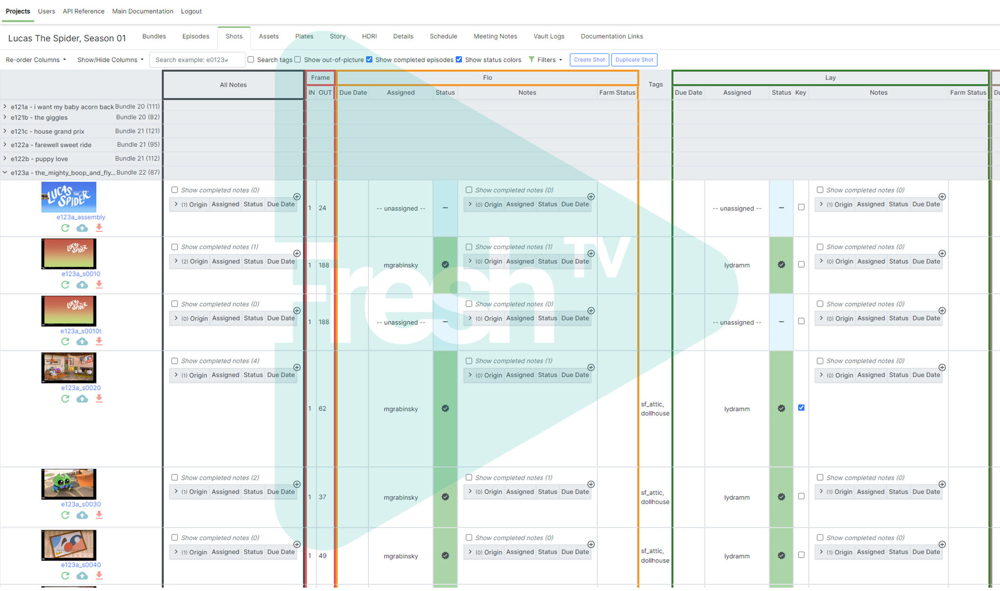
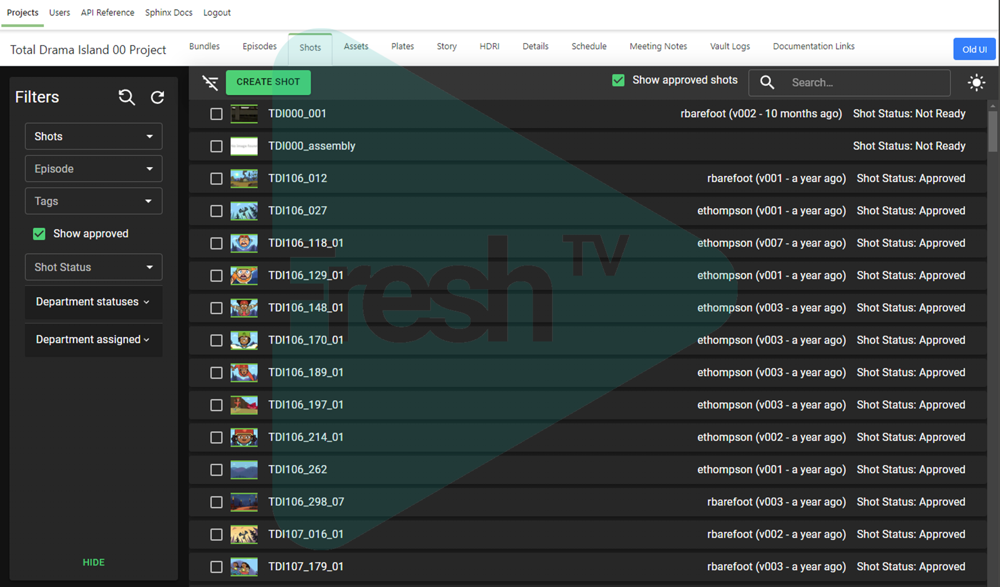
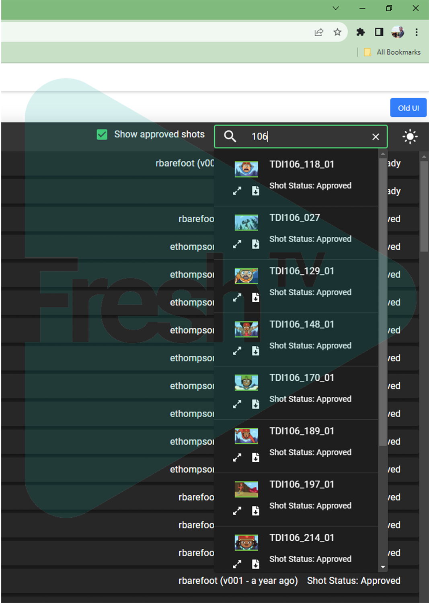
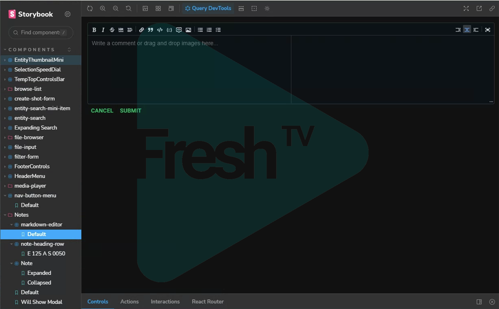

Contents:

- [Collaboration and team](#Collaboration-and-team)

- [VFX Pipeline](#VFX-Pipeline)

- [Web Development](#Web-Development)

<h2 id="introduction">Introduction</h2>

This post will go over some the work I did developing an animation pipeline as a technical director and web developer at Elliott Animation. I can't cover everything I worked on, but I'll try and go over a few of the projects I worked on, and I will try and update this post over time with more. The projects I will talk about here aren't necessarily the most significant or impactful, they will mostly be the ones that are easiest to describe, with less interconnection and context required from the rest of the pipeline. 

I should be clear that I take the confidentiality of employers seriously, and the studio was kind enough to allow me to discuss my work and some details of the pipeline. They also gave me permission to include watermarked images of various tools and UIs.

For those unfamiliar with the term, in the context of animation and vfx production, I prefer to define a production
pipeline with an analogy. I tend to describe the pipeline as an assembly line in a factory producing the show shot
by shot. The artists are the workers, and my work was developing the assembly line itself - the automation and
machinery that reliably moves the product from one stage to the next, and provides tools for the artists to
efficiently interact with the system.

I joined Elliott during production of the first few episodes of Lucas the Spider before we entered full production
and began cranking out episodes on a schedule. Lucas was the first 3d project the studio had worked on in a number
of years, and an entirely new pipeline was developed, along with a production tracking web application built with
Angular. When I started, many of the basic elements of the pipeline were in place, but there were many kinks to work out and features to add as production ramped up.

Some of the work I'll mention here involved relatively minor changes, but small changes were often the most
impactful, and illustrate my ability to identify the low-hanging fruit and make improvements that have an outsize
impact on efficiency and productivity.

<h2 id="collaboration-and-team">Collaboration and team</h2>

At the start of my time at Elliott, much of my work was focused on support tasks, which was a great way to learn the pipeline and codebase. I also built solid working relationships, and a reputation for communicating effectively and solving problems quickly and reliably.

Acting as a point of contact for various departments at the studio to coordinate responses to issues and feature
requests remained an important element of my responsibilities throughout my time at Elliott. Communication and
collaboration is something that is very important to me, and I think this will probably be reflected throughout my
career. I enjoy working with people and doing what I can to make their work easier, through technical and
non-technical solutions.

Over time, I was given the opportunity to take a lot of initiative and ownership of a large number of projects. I was able to
identify areas for improvement and propose solutions, and was given the freedom to implement them. Eventually,
towards the end of my time at the studio I was solely responsible for software development, and worked on R&D for
future projects,
responding to the requirements of artists, and the studio leadership.

One of the most valuable opportunities I had was supervising and mentoring a junior TD who transferred from a rigging background to a TD roll with limited prior coding experience, all self-taught. This was a great experience for me and I learned a lot about how to effectively act in a supervisory role. I was able to help him greatly improve his skills as a developer. I was able to teach him a great deal of programming concepts such as object-programming and in particular best practices for designing and writing maintainable code. This, combined with his knowledge of Autodesk Maya and rigging skills made him a great asset to the team. He also was able to apply his artistic and design background to UI development with QT, greatly improving the look and feel of many of our tools. He has since gone on to a further role as a developer and TD at another studio.

When I started, a significant area of difficulty baked into the way the pipeline worked, was that it was difficult to
both test and develop code intended to run on the render farm, as well as to identify and debug issues with failing
jobs that weren't immediately apparent from the error messages. Both of these issues would often involve a relatively
complicated process to manually copy job files off the render farm, repath, and adjust them to run locally using a
dev version of the toolset. One of the first tasks I took initiative on was developing a variety of solutions to
both these problems. I created a tool run directly from the DeadlineUI to automatically copy code off the farm and
then step through it using a Python debugger. This dramatically improved our ability to quickly diagnose failing
render jobs helping the show ensure consistent output of shots, as well as making it much easier to test new
features. Although this was a relatively small change, my coworker who I worked most closely with described this
one of the most impactful changes I made over my time at the studio. Following this, I continued to develop a
variety of custom tools and scripts for Deadline that could be used to resolve issues on the farm, and I developed
an in depth understanding of Deadline and render farms in general.

#### Infrastructure is part of collaboration and team or part of pipeline?
- Mentoring Matteo - done

- Automated render priorities

- Began customizing deadline itself and adding automation, scripts and features in order to simplify the process of managing the render farm and debugging jobs.

<h2 id="VFX-Pipeline">VFX Pipeline</h2>

The Lucas pipeline was based around Autodesk Maya, with BlackMagic Fusion for compositing.

One of the more complicated dev tasks I worked on was an overhaul of our asset referencing system in order to
support options for swapping full referenced assets with Arnold stand-ins to reduce file sizes in
memory and improve responsiveness for the lighting team. This was a significant overhaul, that touched many areas of the pipeline.

#### Lighting
- After the main production of lucas, we were able to efficiently produce a series of shorts with the lighting department reduced to a single artist. This was possible due to the lighting reuse workflows we had developed over the course of the production. To support this, I overhauled our system for generating fusion comp files to fully automate the process.

I built a tool called the HomeRun Client mainly intended as a scaffold for work on future productions to more
effectively support a fully work from home pipeline. The HomeRun client is installed on a users home workstation
and its basic functionality was to allow the download and upload of shots and assets in an automatically managed local
directory structure, to deploy custom scripts and tools to various DCC software, and to support secure
communication with the web server at the studio.

I'm quite proud of this work, but in particular the deployment process I developed. One of the main requirements was
that it should be as simple as possible to install and should update itself automatically. The key to this was
using our self-hosted Gitlab server to host a Python Package Repository.

From the website, the user would click a link to download a single script used to both install and run the
application. The first time the user downloaded the script, the backend would use the GitLab API to generate a new
API token tied to that users account on rTracker, and written into the script file sent to the user. Running the
script would install the toolset as a Python package using Pip (the Python package manager) or update it if a new
version of the package was available. When the user left the studio and their account was deactivated, the API token would be automatically revoked, blocking their access to the toolset.
This was a seamless approach as more artistic and less technically inclined users would only need to install python and then double-click a single script located anywhere on their computer.

<h2 id="Web-Development">Web Development</h2>

### rTracker

Web development was another major aspect of my work at Elliott. I was initially focused more on the pipeline side of
things as discussed above, despite having a significant background in web development. As time went on however, more
of my efforts were devoted to the web side. As mentioned earlier, Lucas the Spider used a web application called _rTracker_ with an Angular front end and a Flask backend for production tracking and to support remote work. rTracker has similar functionality to Shotgrid, but was developed in-house to meet the specific needs of the studio.

The largest feature I developed for rTracker was a system for reporting job statuses from the render farm to the web app in real time. I created a custom Deadline event plugin that would send a requests to the backend with job status updates, and update the database accordingly, with a simplified version of the information on the farm. This allowed artists who didn't have access to the Deadline UI to see the status of their renders live.

I eventually took over responsibility for server management and configuration for the web applications, and I
set up some fairly complicated changes using Nginx, in order to serve multiple separate front ends and static pages
on different subdomains.

### R&D for future projects.

Towards the end of my time at Elliott, my focus shifted to R&D with the intention of supporting the pipeline needs of
future projects.

The first major element of this was the development of a new front end for the web app. While the previous version of the web app was built with Angular, we decided to switch to React for the new version and develop it largely from the ground up based on requests we received for the UI as well as a focus on maintainability. As my coworker Don, who was the lead developer for the Angular front end had never worked with React, I took the lead on this project designing the architecture of the app and making key decisions about the tech stack.

A new search interface:

I was able to put in place much more tooling than was used for the Angular project. In particular, we used Storybook to develop components of the UI in isolation, as well as Mock Service Worker to mock the API for testing purposes. I really enjoy setting up dev tooling like this, and I think it's an important part of developing a consistent and maintainable codebase. Storybook in particular is an excellent tool with a lot of flexibility, one that I am highly proficient in configuring.

Example of a component isolated for development and testing in Storybook:

