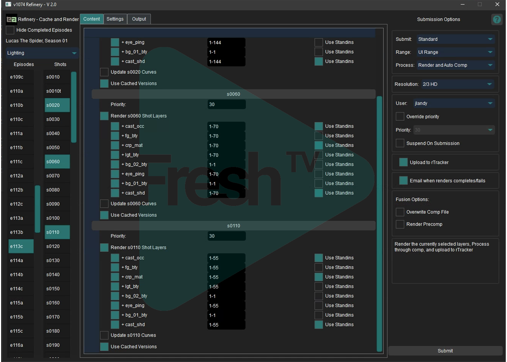
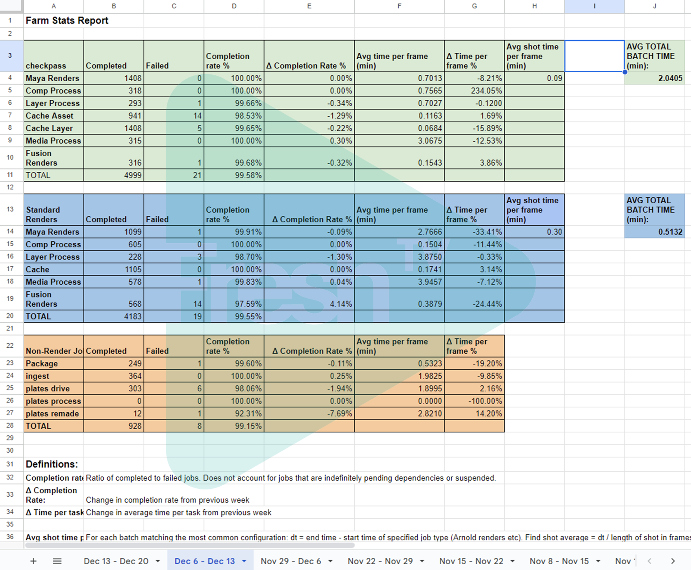
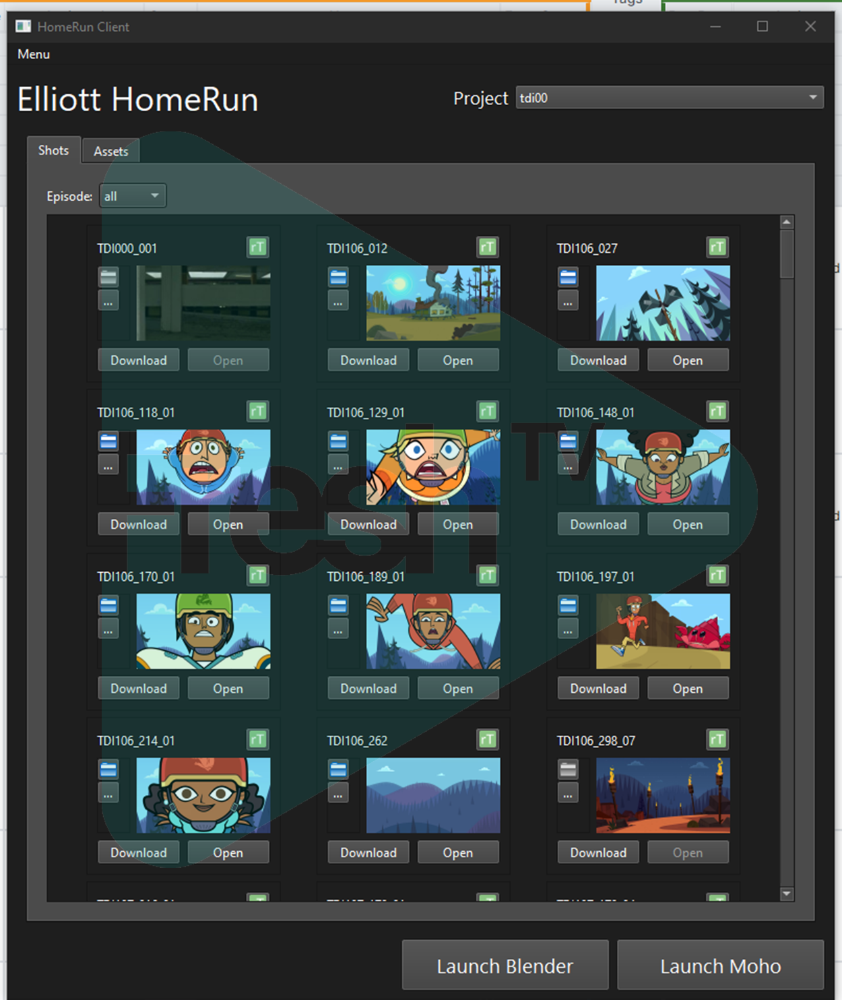
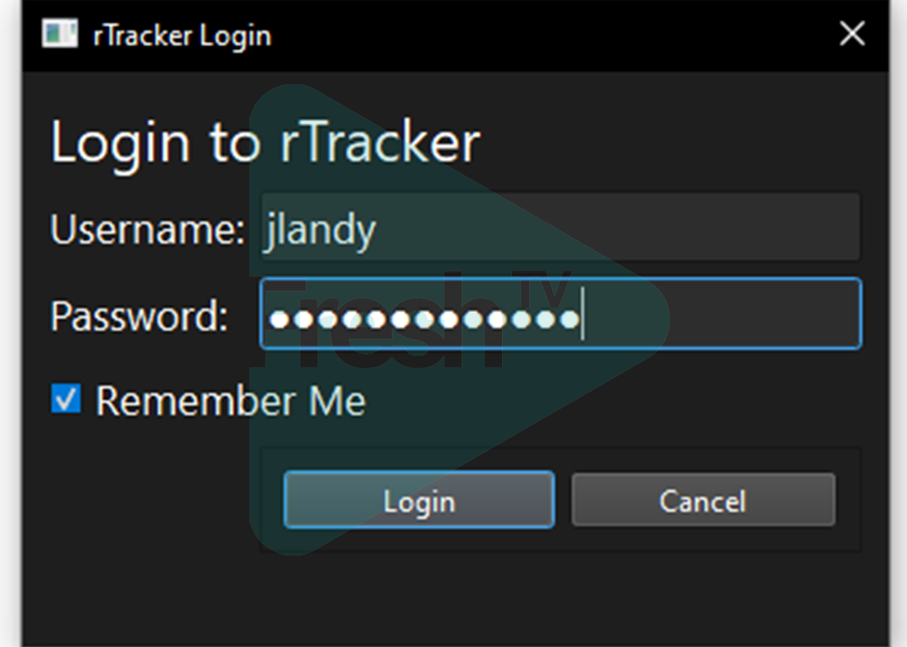

This post will go over some the work I did developing an animation pipeline as a technical director and web developer at Elliott Animation. I can't cover everything I worked on, but I'll try and give an overview focusing on some of the highlights that I think most illustrate my skills and experience.

I'm going to go into more detail here than I would on a resume or LinkedIn, but I'd like to make it clear that I take the confidentiality of my employers seriously. The studio was kind enough to give me permission to discuss the work I did there with some details of the pipeline as well as water marked images of various aspects of this.

### When I started

I joined Elliott I believe during production of the first few episodes of Lucas the Spider before we entered full production and began cranking out episodes on a schedule. Lucas was the first 3d project the studio had worked on in a number of years, and an entirely new pipeline was developed for it along with a production tracking web application developed with Angular. When I started many of the basic elements of the pipeline were in place, but there were many kinks to work out and features to add as production ramped up.

The Lucas pipeline was based around Autodesk Maya, with compositing in BlackMagic Fusion. 

A major focus of my work at the studio on Lucas the Spider, was integration of the pipeline with the render farm, which was built around Thinkbox Deadline. I became very familiar with the ins and outs of Deadline and its API.

We ran a large range of processes on the farm, and it was not limited to strictly rendering using Arnold etc. By the later stages of the production, for the lighting department, a typical render on the farm might involve:
- An initial Python job to process the shot and create individual render jobs for each of the required passes and render layers.
- Jobs to output cache files for each of the layers.
- Arnold render jobs for each layer.
- A job to generate a Fusion comp file from a template file based on the layers rendered.
- A job to render the comp file using Fusion.
- A job to generate a preview video and thumbnail from the comp output using FFmpeg and upload it to the web application.

Much of the work done as part of our work from home pipeline went through the render farm as well, with jobs submitted to the farm from the web application to package files for download, and ingest files uploaded by artists.

I worked on many of these automated processes. 

I also spent a great deal of time developing our primary tool used for submitting jobs to the farm, shown in the following image. 

#### Farm Reports
One of my first tasks was developing a system for collecting performance data from the farm, computing some statistics, and generating weekly reports. The first iterations of this required a somewhat arduous manual process running various scripts and then copying the output into a spreadsheet. Fortunately, I was able to use the Google Sheets API to automate this and generate the reports without human intervention.

- some of the first work I did was support tasks, often issues on the render farm. 
  - fast paced, I liked that.
  - Began customizing deadline itself and adding automation, scripts and features in order to simplify the process of managing the render farm and debugging jobs. 
  - Worked on a process for automatically collecting data on render farm performance and generating reports, using the Deadline and Google Sheets api.
  - Simplified process of debugging python jobs on render farm.

- At the end of Lucas we migrated and tested the entire codebase to Python 3.
- Set up open API specs and swagger UI for the web api.
- Modified deployment process to manage packages with pip and conduct configuration tasks automatically. 
- Mentoring Matteo
- Wrote onboarding documentation.
- Sped up database code.
- Migrated to self hosted gitlab.
- investigated moving to YouTrack as a system for tracking support requests and dev tasks. 
- Automated render priorities.

The largest feature I developed during the production of Lucas was a system for reporting job statuses from the render farm on the web application. I created a custom Deadline event plugin that would send a requests to the  

I built a toolset in a separate repository mainly intended as a scaffold for work on future productions intended to more effectively support a fully work from home pipeline. These tools were intended to be installed on users home workstations and would allow them to download and upload shots and assets to a local directory structure in a predictable way. I'm quite proud of this work, but in particular the deployment process I developed. One of the key requirements of this was that it should be as simple as possible to install and should update itself seamlessly. The key to this was using the self-hosted GitLab server we had migrated to. This allowed us to host a Python Package Repository on the server.

From the website, the user would click a link to download a single script used to both install and run the application. The first time the user downloaded the script, the backend would use the GitLab API to generate a new API token tied to that users account on rTracker, and written into the script file sent to the user. Running the script would install toolset as a Python package using Pip (the Python package manager) or update it if a new version of the package was available. When the user left the studio and their account was deactivated, the API token would be automatically revoked, blocking their access to the toolset. 
This was a seamless approach as more artistic and less technically inclined users would only need to install python and then double-click a single script located anywhere on their computer.

