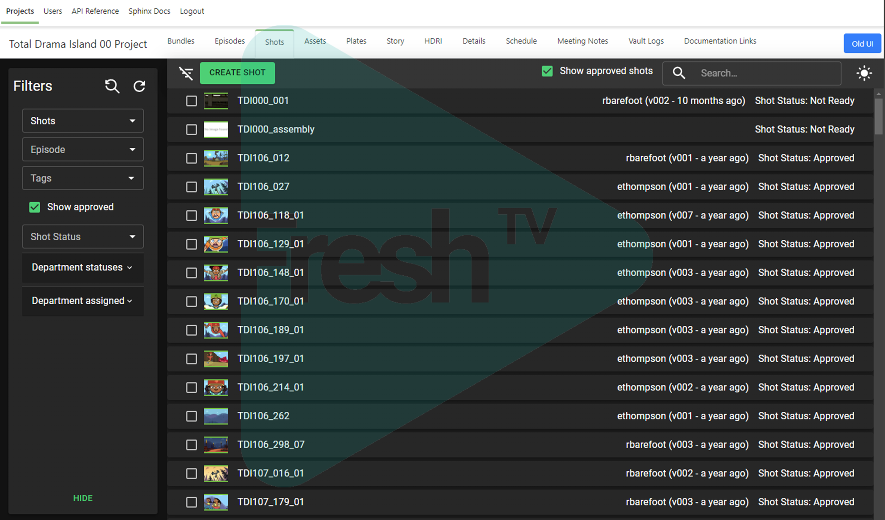
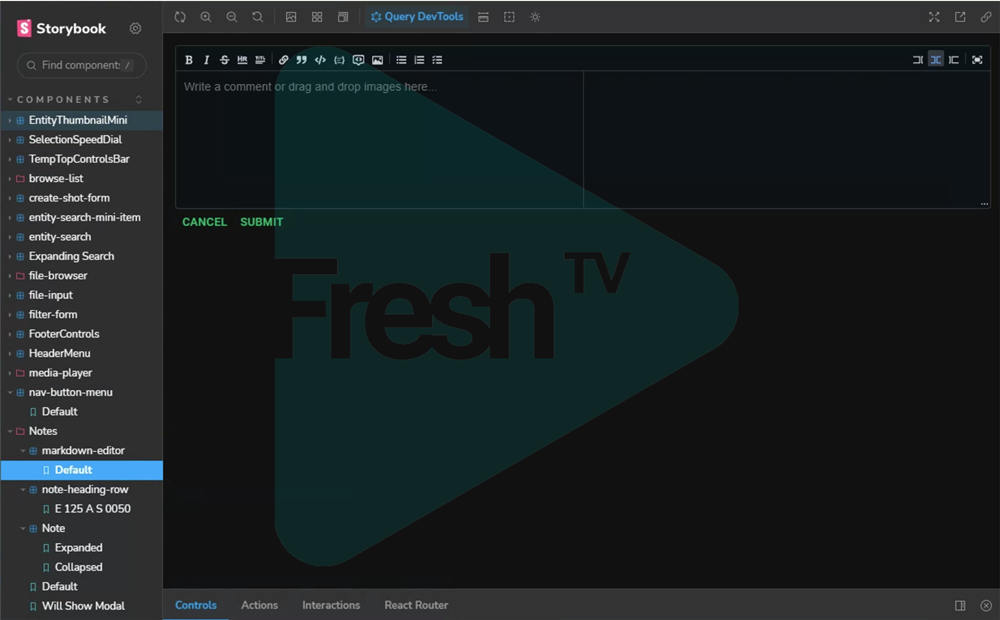

This post will go over some the work I did developing an animation pipeline as a technical director and web developer at Elliott Animation. I can't cover everything I worked on, but I'll try and give an overview focusing on some of the highlights that I think most illustrate my skills and experience.

I should be clear that I take the confidentiality of employers seriously, and the studio was kind enough to allow me to discuss my work and some details of the pipeline. They also gave me permission to include watermarked images of various tools and UIs. 

### When I started

I joined Elliott during production of the first few episodes of Lucas the Spider before we entered full production and began cranking out episodes on a schedule. Lucas was the first 3d project the studio had worked on in a number of years, and an entirely new pipeline was developed, along with a production tracking web application built with Angular. When I started many of the basic elements of the pipeline were in place, but there were many kinks to work out and features to add as production ramped up.

The Lucas pipeline was based around Autodesk Maya, with BlackMagic Fusion for compositing. 

At the start of my time at Elliott, much of my work was focused on support tasks, which was a great way to learn the pipeline and codebase. I also built solid working relationships, and a reputation for communicating effectively and solving problems quickly. Since many of the issues I resolved occurred on the render farm, I became very familiar with the architecture of Thinkbox Deadline and it's API.

Following this, as I switched over more fully to dev tasks, integration of the pipeline with the render farm remained a major focus of my work.

### Render Farm

We ran a wide range of processes on the farm, and it was not limited to strictly rendering using Arnold etc. By the later stages of the production, for the lighting department, a typical render on the farm might involve:
- An initial Python job to process the shot and create individual render jobs for each of the required passes and render layers.
- Jobs to output cache files for each of the layers.
- Arnold render jobs for each layer.
- A job to generate a Fusion comp file from a template file based on the layers rendered.
- A job to render the comp file using Fusion.
- A job to generate a preview video and thumbnail from the comp output using FFmpeg and upload it to the web application.

Much of the work done as part of our work from home pipeline went through the render farm as well, with jobs submitted to the farm to package files for download, and ingest files uploaded by artists.

I worked on many of these automated processes. 

I also contributed various features and fixes to Refinery, our primary Qt based GUI for submitting renders, shown in the following image. These included submitting jobs with a priority calculated automatically based on values defined by production on a weekly basis, and controls for overriding various Arnold render settings from the UI at submission time.

#### Farm Reports
One of my first dev tasks was developing a system for collecting performance data from the farm, computing some statistics, and generating weekly reports. The first iterations of this required a somewhat arduous manual process running various scripts and then copying the output into a spreadsheet. Fortunately, I was able to use the Google Sheets API to automate this and generate the reports without human intervention.

One of the more complicated dev tasks I worked on was an overhaul of our asset referencing system in order to support options for swapping full referenced assets with Arnold stand-ins to reduce file sizes in memory and improve responsiveness for the lighting team. 

  - Began customizing deadline itself and adding automation, scripts and features in order to simplify the process of managing the render farm and debugging jobs.
  - Simplified process of debugging python jobs on render farm.

- At the end of Lucas we migrated and tested the entire codebase to Python 3.
- Set up open API specs and swagger UI for the web api.
- Modified deployment process to manage packages with pip and conduct configuration tasks automatically. 
- Mentoring Matteo
- Wrote onboarding documentation.
- Sped up database code.
- Migrated to self-hosted gitlab.
- investigated moving to YouTrack as a system for tracking support requests and dev tasks. 
- Automated render priorities. - done

The largest feature I developed on the web app during the production of Lucas was a system for reporting job statuses from the render farm on the web application. I created a custom Deadline event plugin that would send a requests to the  

### R&D for future projects.

Towards the end of my time at Elliott, focus shifted to R&D with the intention of supporting the pipeline needs of future projects. 

The first major element of this was the development of a new front end for the web app. While the previous version of the web app was built with Angular, we decided to switch to React for the new version and develop it largely from the ground up based on requests we received for the UI as well as a focus on maintainability. As my coworker Don, who was the lead developer for the Angular front end had never worked with React, I took the lead on this project designing the architecture of the app and making key decisions about the tech stack.

I was able to put in place much more tooling than was used for the Angular project. In particular, we used Storybook to develop components of the UI in isolation, as well as Mock Service Worker to mock the API for testing purposes. I really enjoy setting up dev tooling like this, and I think it's an important part of developing a consistent and maintainable codebase.

Example of a component isolated for development and testing in Storybook:

I built a tool called the HomeRun Client mainly intended as a scaffold for work on future productions to more effectively support a fully work from home pipeline. The HomeRun client is installed on a users home workstation. 

The basic functionality of these tools was to allow the download and upload of shots and assets in an automatically managed local directory structure, to deploy custom scripts and tools to various DCC software, and to support secure communication with the web server at the studio. 

I'm quite proud of this work, but in particular the deployment process I developed. One of the key requirements of this was that it should be as simple as possible to install and should update itself seamlessly. The key to this was using the self-hosted GitLab server we had migrated to. This allowed us to host a Python Package Repository on the server.

From the website, the user would click a link to download a single script used to both install and run the application. The first time the user downloaded the script, the backend would use the GitLab API to generate a new API token tied to that users account on rTracker, and written into the script file sent to the user. Running the script would install toolset as a Python package using Pip (the Python package manager) or update it if a new version of the package was available. When the user left the studio and their account was deactivated, the API token would be automatically revoked, blocking their access to the toolset. 
This was a seamless approach as more artistic and less technically inclined users would only need to install python and then double-click a single script located anywhere on their computer.

