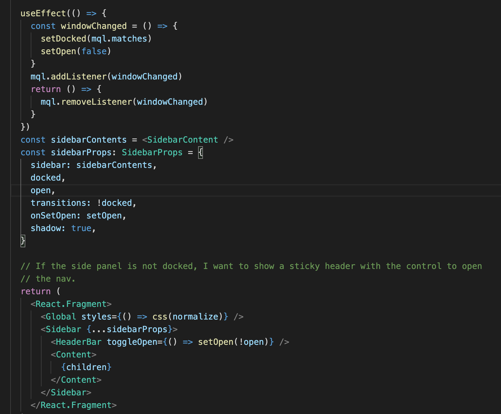

Personal Website
===

I built this website using Gatsby, a platform for developing static websites using React components. I hadn't used Gatsby before and essentially chose it at random, but I quickly came to appreciate it. It is an absolute joy to work with and I would very happily use it in future.

I gained some experience in a few areas including CSS grid layout, and GraphQl.

Graphic design has never been my strong point, and I initially intended to find an attractive template and adapt it as little as possible with my own content. After spending time searching I didn't feel satisfied entirely satisfied with any of the templates I found and ended up building my website largely from scratch, taking design cues from a variety of websites online.