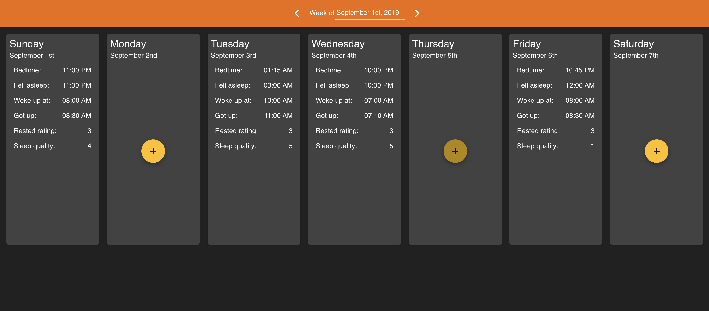
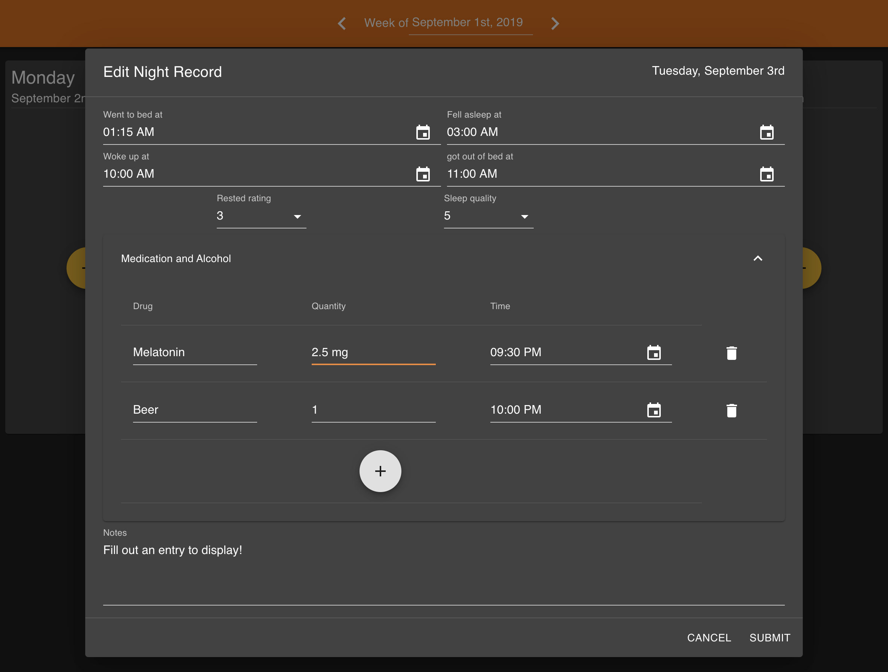

I built this application to record data about my sleep and track how different factors affect it, when I didn't find an existing option I was satisfied with. I've struggled a lot with sleep issues since adolescence, and I've found that data collection is helpful for evaluating the effectiveness of different management strategies.

It was important to me to define the variables and and access and analyze the raw data myself, rather than trying to fit myself into someone else's system.

The front end was written in Typescript using React and the Material-UI library, while the backend was also developed with Typescript and stores collected data in MongoDB. I considered using an SQL database, but ultimately decided that MongoDB had a lot of advantages, principally its commonalities with JavaScript.

In the course of this project, I learned a lot about some of the tooling available for developing web apps. In particular, I found [Storybook](https://storybook.js.org/), an environment for developing the individual components of a UI in isolation invaluable as the application got past a certain level of complexity.

