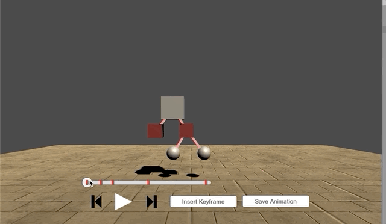

Unity Animation Editor
===

This project implements simplified keyframe animation on a timeline to edit animations in Unity's .anim format at runtime.
I built it as a first step towards a system for posing and animating life size 3d characters in VR. I find VR development somewhat more tiring, so I've learned to avoid involving VR as much as possible before putting on the headset.

The simple GUI allows playing back animations on a timeline.

And inserting keyframes (marked in red). 

I considered it important to support animating hierarchies, since that is critical for animating characters. 

